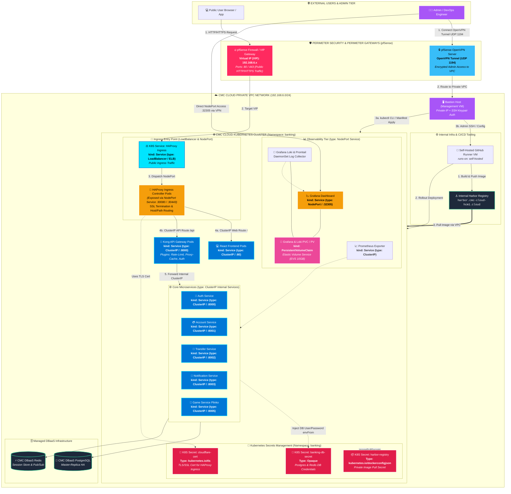

# 🌐 Sơ Đồ Kiến Trúc Topo Mạng & Luồng Quản Trị K8S (CMC Cloud HCM1)

Tài liệu thể hiện sơ đồ Topo kiến trúc phân tầng của hệ thống **Banking Microservices** trên cụm CMC Cloud K8S. Sơ đồ mô tả chi tiết **các K8S Secrets (`banking-db-secret`, `cloudflare-cert`, `harbor-registry`)**, **các loại K8S Service (`LoadBalancer / ELB`, `NodePort`, `ClusterIP`)**, **Persistent Volume (PV/PVC EVS)** gắn với Grafana/Loki, luồng người dùng qua **pfSense Firewall VIP**, luồng quản trị viên qua **pfSense OpenVPN Server**, và luồng **CI/CD Runner**.

---

## 🎨 1. Sơ Đồ Kiến Trúc Topo Mạng Chuẩn Hóa (Mermaid Diagram)

---

## 🔐 2. Phân Tích Chi Tiết Các K8S Secrets Trong Hệ Thống

| Tên Secret K8S | Loạt Secret (`Type`) | Thành Phần Sử Dụng | Mục Đích & Nội Dung Bảo Mật |
| :--- | :--- | :--- | :--- |
| **`banking-db-secret`** | `Opaque` | Backend Pods (`auth`, `account`, `transfer`, `notification`, `game`) | Chứa thông tin đăng nhập DBaaS PostgreSQL & Redis (`POSTGRES_USER`, `POSTGRES_PASSWORD`, `REDIS_PASSWORD`). Được inject trực tiếp vào môi trường Pods qua `envFrom`. |
| **`cloudflare-cert`** | `kubernetes.io/tls` | HAProxy Ingress Controller | Chứa SSL/TLS Certificate & Private Key của Cloudflare (`tls.crt`, `tls.key`) phục vụ giải mã HTTPS SSL Termination tại Ingress. |
| **`harbor-registry`** | `kubernetes.io/dockerconfigjson` | K8S Worker Nodes / Kubelet | Chứa thông tin Docker Auth Config (`.dockerconfigjson`) giúp K8S kéo (`imagePullSecrets`) các private container images từ Harbor Registry nội bộ. |

---

## 🔍 3. Phân Tích Các Loại Service K8S & Persistent Volume (PV/PVC)

### 📌 Bảng Tổng Hợp Các Loại Kubernetes Service Trong Dự Án

| Tên Service K8S | Loại Service (`kind: Service`) | Cổng Mở (Port Mapping) | Mục Đích Sử Dụng |
| :--- | :--- | :--- | :--- |
| **HAProxy Ingress ELB** | `type: LoadBalancer` (ELB) | Cổng VIP Public `:80`, `:443` | Tiếp nhận traffic từ pfSense VIP và cân bằng tải vào cụm K8S |
| **HAProxy Ingress Pods** | `type: NodePort` | `:30080` (HTTP), `:30443` (HTTPS) | Lắng nghe cổng NodePort trên Worker Nodes |
| **Grafana Dashboard** | `type: NodePort` | NodePort `:32305` | Cho phép Admin truy cập xem biểu đồ trực tiếp khi kết nối VPN |
| **Kong API Gateway** | `type: ClusterIP` | Internal ClusterIP `:8000` | Điểm quản lý API tập trung, ẩn hoàn toàn trong mạng nội bộ |
| **Frontend (React UI)** | `type: ClusterIP` | Internal ClusterIP `:80` | Phục vụ giao diện static web Nginx nội bộ |
| **Core Microservices** | `type: ClusterIP` | Internal ClusterIP `:8000` - `:8005` | Bảo vệ 5 backend microservices (Auth, Account, Transfer, Notify, Game) |

---

### 💾 Storage Persistent Volume (PV / PVC EVS) Gắn Với Grafana & Loki

- **Tài nguyên**: **PersistentVolumeClaim (`kind: PersistentVolumeClaim`)** tên `GrafanaPVC` liên kết với **CMC Cloud Elastic Volume Service (EVS 10GB)**.
- **Đặc điểm**: Ghi liên tục dữ liệu log từ **Loki** và Dashboard Grafana vào EVS Volume, đảm bảo tính bền vững dữ liệu khi Pod bị tái tạo (`Self-Healing`).

